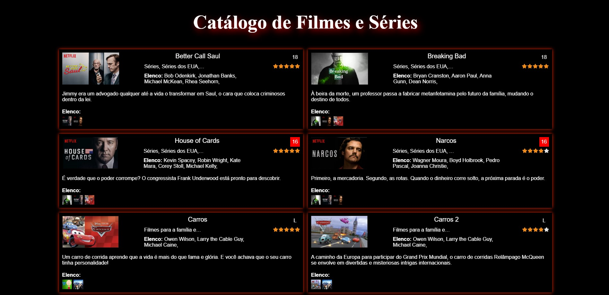

<h1 align="center">
<p ><b>Catálogo <b style="text-decoration: none; color: red">AJAX</b> 🎬🍿<b></p>


<br>
</h1>


<a href="https://catalogo-ajax.netlify.app/" style="text-decoration: none; color: #8b0000">
<h2 style="text-align: center; margin: 0;">🛩️ Para explorar o site, clique aqui!</h2>
</a>


## 📚 Sobre

#### Este site é um catálogo de filmes e séries responsivo desenvolvido utilizando **HTML, CSS, JavaScript** e a técnica **Ajax** para fornecer uma experiência interativa aos usuários. A estrutura HTML define a organização dos elementos na página, enquanto o CSS estiliza o layout, definindo cores, fontes e espaçamentos. O JavaScript é utilizado para fazer requisições assíncronas ao servidor e manipular os dados recebidos, permitindo a exibição dinâmica das informações sobre os filmes e séries. Além disso, o site faz uso de bibliotecas como **jQuery e Bootstrap** para facilitar o desenvolvimento e adicionar funcionalidades extras, como **manipulação do DOM** e estilização de componentes, contribuindo para uma interface atraente e uma experiência de usuário mais completa.


## 🔨 Ferramentas

- [HTML5](https://www.w3schools.com/html/)
- [CSS3](https://www.w3schools.com/css/)
- [JavaScript](https://www.w3schools.com/js/)
- [AJAX](https://www.w3schools.com/xml/ajax_intro.asp)
- [JQuery](https://www.w3schools.com/jquery/default.asp)
- [Bootstrap](https://www.w3schools.com/bootstrap/)

## 🕹️  Funcionalidades

- **Indicação de classificação etária:** Uma funcionalidade importante é a indicação da classificação etária de cada título, representada por ícones coloridos. Esses ícones fornecem aos usuários uma rápida e visual indicação da faixa indicativa de idade para a qual o filme ou série é recomendado. Isso permite aos usuários tomar decisões informadas sobre o conteúdo que desejam assistir, garantindo uma experiência adequada às suas preferências e restrições de idade.

- **Avaliação média dos usuários:** O site também inclui uma funcionalidade que apresenta uma avaliação média baseada nas opiniões dos usuários. Essa avaliação é indicada por um conjunto de estrelas amarelas, oferecendo aos usuários uma métrica visual para avaliar a qualidade e popularidade de cada título. Essa funcionalidade ajuda os usuários a identificar rapidamente os filmes e séries mais bem avaliados dentro do catálogo, facilitando a seleção de conteúdos de alta qualidade.

- **Integração com redes sociais e informações adicionais no rodapé:** O site oferece links para redes sociais, como WhatsApp, Instagram e LinkedIn, permitindo aos usuários compartilhar facilmente o catálogo com amigos e familiares. Além disso, o rodapé inclui informações sobre o autor do site e seu portfólio, fornecendo aos usuários uma maneira de saber mais sobre quem está por trás do desenvolvimento do catálogo. Essa integração com redes sociais e o fornecimento de informações adicionais no rodapé contribuem para uma experiência de usuário mais completa e informativa.

## ♻️ Como contribuir para este projeto

```bash
# Clone o projeto
$ git clone https://github.com/rafaelbcabral/catalogo-ajax.git
````
<br>

````bash
# Entrar no diretório
$ cd catalogo-ajax
````
<br>

````bash
# Instalar as dependencias, caso use npm
$ npm install
````

<p style="text-align: center; font-size: 15px; "><b>OR</b></p>

````bash
# Caso use Yarn
$ yarn
````

<h1></h1>
<p style="text-align: center; font-weight: bold; font-size: 20px">End</p>


